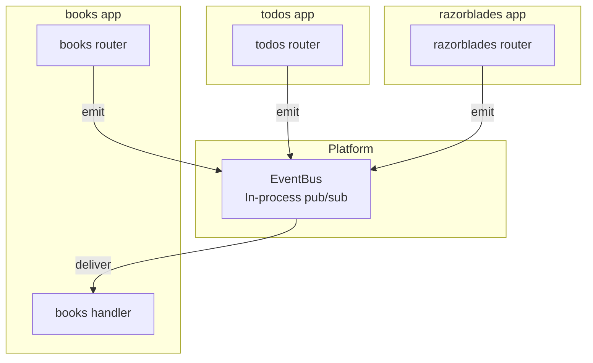

# Inter-App Event Bus — Architecture Groundwork

> **Status: Not yet implemented.**
> The `events.emits` and `events.consumes` fields in each app's `manifest.json`
> are parsed and validated at startup but not yet acted upon.  This document
> records the intended design so the eventual implementation has a clear target.

---

## Why an Event Bus?

Apps co-hosted on the shared platform are intentionally isolated — separate
databases, separate routers, separate frontends.  An event bus provides a
lightweight, decoupled channel for one app to react to things that happen in
another without creating direct import dependencies.

Example use-cases:

- `todos` notifies `books` when a reading-related task is completed.
- A future `stats` dashboard subscribes to events from all apps to build an
  activity feed.
- A future `reminders` app listens for `razorblades.blade.retired` to suggest
  ordering a replacement.

---

## Manifest Contract

Each app declares its participation in the bus inside `manifest.json`:

```json
"events": {
  "emits":    ["todos.item.created", "todos.item.completed"],
  "consumes": ["books.item.completed"]
}
```

### Naming Convention

```
<app>.<noun>.<verb>
```

| Segment | Rules | Examples |
|---------|-------|---------|
| `app`   | Must match the emitting app's `name` slug | `todos`, `books`, `razorblades` |
| `noun`  | Lowercase, singular | `item`, `blade`, `entry` |
| `verb`  | Past tense | `created`, `updated`, `deleted`, `completed`, `retired` |

Full regex: `^[a-z][a-z0-9_-]*(\.[a-z][a-z0-9_-]*)+$`

---

## Planned Architecture



### Components

| Component | Location (planned) | Responsibility |
|-----------|-------------------|----------------|
| `EventBus` class | `backend/event_bus.py` | In-process pub/sub registry; `emit(event_type, payload)` and `subscribe(event_type, handler)` |
| Platform startup | `backend/main.py` | Read `events.consumes` from each manifest; wire subscriptions before first request |
| App routers | `apps/<name>/backend.py` | Import the shared `EventBus` instance; call `bus.emit(...)` after mutating state |
| App handlers | `apps/<name>/backend.py` | Register `@bus.on("other.noun.verb")` callbacks |

### Event Payload Schema (Draft)

```json
{
  "event_type": "todos.item.created",
  "app":        "todos",
  "timestamp":  "2026-03-09T12:00:00Z",
  "payload":    { "id": 42, "title": "Buy milk", "done": false }
}
```

`payload` is app-defined; no cross-app schema enforcement in v1.

---

## Groundwork Already in Place

- `backend/event_bus.py` — skeleton `EventBus` class (in-process, sync).
- `apps/manifest.schema.json` — `events.emits` / `events.consumes` arrays
  validated at startup.
- All three existing apps declare their events in their manifests:
  - `todos`: emits `todos.item.created`, `todos.item.updated`, `todos.item.deleted`
  - `books`: emits `books.item.created`, `books.item.completed`
  - `razorblades`: emits `razorblades.blade.created`, `razorblades.blade.retired`

---

## Implementation Checklist (Future Work)

- [ ] `EventBus.emit()` — publish a typed event to all registered handlers
- [ ] `EventBus.subscribe()` — register a callable for an event type
- [ ] Platform startup wires subscriptions from manifest `events.consumes`
- [ ] App routers emit events after successful DB mutations
- [ ] Add async support if handlers need to be non-blocking
- [ ] Consider persistence layer (SQLite log) for at-least-once delivery
- [ ] Cross-app integration tests

---

## Current `backend/event_bus.py` Skeleton

The file exists and is tested.  It provides the interface surface that future
platform wiring will use — so app routers can start calling `bus.emit()`
without waiting for the subscriber side to be built.
